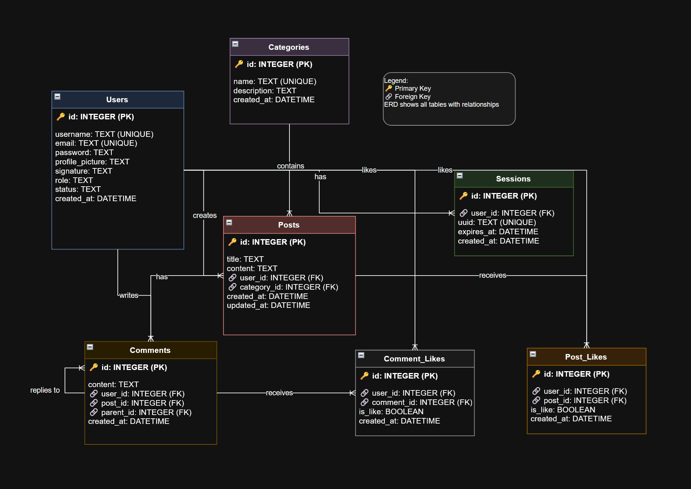

# Literary Lions Forum

A web forum application for the Literary Lions book club to facilitate online discussions, book reviews, and literary engagement.

## Features

- **User Authentication** - Secure registration and login system
- **Threaded Comments** - Unlimited nested comment replies
- **Post Categories** - Organize discussions by books and topics
- **Like/Dislike System** - Rate posts and comments
- **Search & Filtering** - Find posts with real-time suggestions
- **User Profiles** - Custom avatars and signatures
- **Admin Panel** - User management and moderation tools
- **Night Mode** - Dark theme support
- **Responsive Design** - Mobile-friendly interface
- **Docker Support** - Easy deployment

## Technology Stack

- **Backend**: Go 1.24.3+ with SQLite database
- **Frontend**: HTML/CSS templates with custom styling
- **Authentication**: Secure session-based with UUID tokens
- **Deployment**: Docker containerization

## Entity Relationship Diagram (ERD)


##


## Quick Start

### Local Development

1. **Clone and setup**:
   ```bash
   cd literary-lions
   go mod tidy
   ```

2. **Run the application**:
   ```bash
   go run main.go
   ```

3. **Visit** `http://localhost:8080`

### Docker Deployment

1. **Build image**:
   ```bash
   docker build -t literary-lions-forum .
   ```

2. **Run container**:
   ```bash
   docker run -p 8080:8080 literary-lions-forum
   ```

## Usage

1. **Register** an account or login
2. **Create posts** in different categories
3. **Join discussions** with threaded comments
4. **Like/dislike** posts and comments
5. **Search** for topics of interest
6. **Customize** your profile
7. **Toggle night mode** for better reading

## Admin Features

- Default admin account: `admin@admin.com` PW: `admin`
- User management dashboard at `Admin` page
- Suspend/unsuspend users
- Delete user accounts
- View user statistics

## Project Structure

```
literary-lions/
├── main.go           # Application entry point
├── auth/             # Authentication logic
├── database/         # Database models and operations
├── handlers/         # HTTP route handlers
├── models/           # Data structures
├── templates/        # HTML templates
├── static/           # CSS, images, assets
├── forum.db          # SQLite database
└── Dockerfile        # Container configuration
```

## Credits

This project is a collaborative effort of Johannes Roto and Kai Huikuri