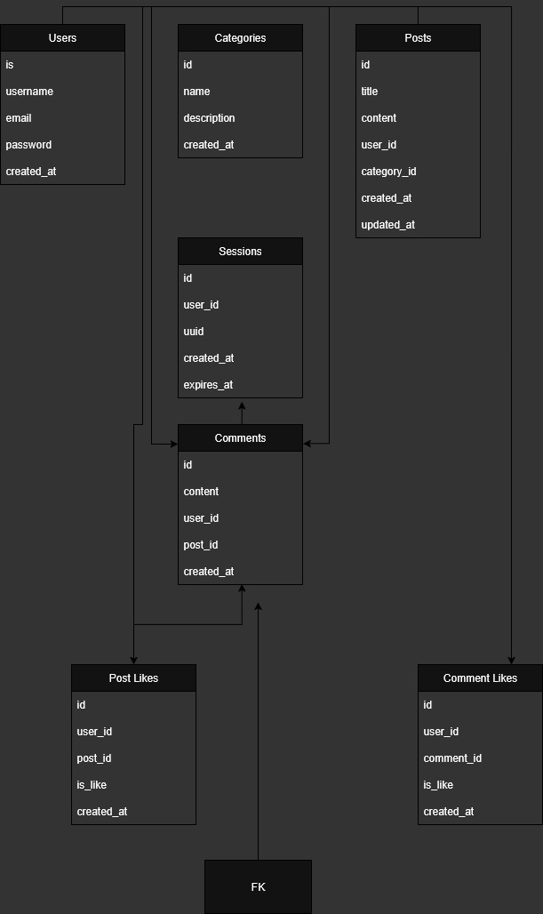

# Literary Lions Forum

A web forum application for the Literary Lions book club to facilitate online discussions, book reviews, and literary engagement.

## Features

- **User Authentication**: Secure registration and login with session management
- **Threaded Comments System**: Unlimited nested comment replies with hierarchical display
- **Posts & Comments**: Create and view posts with comprehensive commenting system
- **Categories**: Organize posts by categories (specific books, genres, analyses, etc.)
- **Like/Dislike System**: Rate posts and comments with interactive buttons
- **Post Filtering**: Filter by category, user's created posts, or liked posts
- **🔍 Advanced Search**: Search posts with real-time auto-suggestions API
- **👤 User Profiles**: Extended user profiles with avatars, signatures, and statistics
- **🛡️ Admin Panel**: Complete admin system with user management capabilities
  - User role management (admin/user)
  - User suspension and unsuspension
  - User deletion with data cleanup
  - Admin control panel dashboard
- **🌙 Night Mode**: Comprehensive dark theme with toggle functionality
- **📊 User Statistics**: Track post counts, comment counts, and user activity
- **Profile Management**: Edit profiles, upload avatars, customize signatures
- **Secure**: Password encryption and UUID-based session management
- **Responsive Design**: Mobile-friendly interface with modern UI
- **Dockerized**: Easy deployment with Docker

## Technology Stack

- **Backend**: Go 1.24.3+ with standard library and minimal dependencies
- **Database**: SQLite with go-sqlite3 driver
- **Frontend**: HTML/CSS templates with progressive enhancement
- **Styling**: 700+ lines of custom CSS with night mode support
- **Authentication**: Secure session-based with cookies and UUIDs
- **Templating**: Go's html/template with custom functions
- **Middleware**: Custom logging, recovery, and authentication middleware
- **File Handling**: Static file serving and upload management
- **API Design**: RESTful endpoints with JSON responses
- **Containerization**: Docker with multi-stage builds

## Entity Relationship Diagram (ERD)



### Database Schema Overview

The Literary Lions Forum uses a comprehensive database schema designed to support all advanced features:

#### Core Tables:
- **Users**: User accounts with profiles, roles, and status management
- **Categories**: Discussion categories for content organization
- **Posts**: Forum posts with metadata and statistics
- **Comments**: Threaded comments with parent-child relationships for unlimited nesting
- **Sessions**: Secure user session management with expiration

#### Feature Tables:
- **Post_Likes**: Like/dislike tracking for posts
- **Comment_Likes**: Like/dislike tracking for comments at all nesting levels

#### Key Relationships:
- **Users 1:M Posts**: One user can create many posts
- **Users 1:M Comments**: One user can create many comments
- **Posts 1:M Comments**: One post can have many comments
- **Comments 1:M Comments**: Self-referencing relationship for threaded comments
- **Categories 1:M Posts**: One category can contain many posts
- **Users 1:M Sessions**: One user can have multiple sessions
- **Users M:M Posts**: Through Post_Likes - many users can like many posts
- **Users M:M Comments**: Through Comment_Likes - many users can like many comments

#### Advanced Features:
- **Threaded Comments**: Uses `parent_id` foreign key for unlimited nesting depth
- **User Roles**: Admin and user roles with appropriate permissions
- **User Status**: Active/suspended status management
- **Extended Profiles**: Support for avatars and signatures

## API Routes & Endpoints

### Public Routes (No Authentication Required)
- `GET /` - Home page with post listings and filters
- `GET /login` - Login page
- `POST /login` - User authentication
- `GET /register` - Registration page
- `POST /register` - User registration
- `GET /post/{id}` - View individual post with threaded comments
- `GET /profile/{username}` - View user profile
- `GET /search` - Search posts with filters
- `GET /api/search-suggestions` - Auto-complete search suggestions API
- `GET /static/` - Static assets (CSS, images, etc.)

### Protected Routes (Authentication Required)
- `GET /logout` - User logout
- `GET /create-post` - Create new post form
- `POST /create-post` - Submit new post
- `POST /create-comment` - Submit comment or reply
- `POST /like-post` - Like/dislike posts
- `POST /like-comment` - Like/dislike comments
- `GET /edit-profile` - Edit user profile form
- `POST /edit-profile` - Update user profile
- `POST /delete-profile` - Delete user account

### Admin Routes (Admin Role Required)
- `GET /admin` - Admin control panel dashboard
- `POST /admin/suspend` - Suspend/unsuspend users
- `POST /admin/delete` - Delete user accounts
- `GET /admin/users` - Manage user accounts
- `GET /admin/stats` - View system statistics

### Error Handling
- `GET /404` - Custom 404 error page
- `GET /500` - Custom 500 error page
- Recovery middleware for panic handling

## Setup Instructions

### Prerequisites
- Go 1.24.3 or higher
- Docker (optional, for containerized deployment)

### Local Development

1. Clone the repository and navigate to the project directory:
```bash
cd literary-lions
```

2. Install dependencies:
```bash
go mod tidy
```

3. Run the application:
```bash
go run main.go
```

4. Open your browser and visit `http://localhost:8080`

### Docker Deployment

1. Build the Docker image:
```bash
docker build -t literary-lions-forum .
```

2. Run the container:
```bash
docker run -p 8080:8080 literary-lions-forum
```

## Usage

### General User Features
1. **Registration**: Create an account with email, username, and password
2. **Login**: Access your account using email and password
3. **Create Posts**: Share your literary thoughts with categories
4. **Threaded Comments**: Engage in discussions with unlimited reply depth
5. **Like/Dislike**: Express your opinion on posts and comments
6. **Filter & Search**: Find posts by category, user, or search terms
7. **Profile Management**: Customize your profile with avatars and signatures
8. **Night Mode**: Toggle between light and dark themes

### Admin Features
The system includes a comprehensive admin panel for user management:

#### Admin Panel Dashboard (`/admin`)
- **User Management**: View all registered users with statistics
- **User Statistics**: See post counts, comment counts, and activity metrics
- **Role Management**: Identify admins vs regular users
- **Account Status**: Monitor active and suspended users

#### User Moderation
- **User Suspension**: Temporarily suspend problematic users
  - Suspended users cannot create posts or comments
  - Existing content remains visible with "suspended" indicator
  - Reversible action - admins can unsuspend users
- **User Deletion**: Permanently remove user accounts
  - Cascading deletion removes all user content
  - Includes posts, comments, likes, and sessions
  - Irreversible action with confirmation requirement

#### Admin Access
- **Default Admin**: Created automatically with email `admin@literarylions.com`
- **Admin Routes**: Protected by admin middleware
- **Role-Based Access**: Only users with `role = 'admin'` can access admin features

### Advanced Features
- **Search System**: Real-time search with auto-suggestions
- **Responsive Design**: Works on desktop and mobile devices
- **Session Management**: Secure UUID-based sessions with expiration
- **Error Handling**: Custom 404/500 pages with recovery middleware

### Threaded Comments System
The forum implements a sophisticated threaded comments system with unlimited nesting depth:

#### Features
- **Unlimited Nesting**: Comments can be replied to at any depth level
- **Hierarchical Display**: Comments are visually indented to show reply structure
- **Parent-Child Relationships**: Each comment can reference a parent comment
- **Interactive Reply Forms**: Reply buttons appear on each comment for easy interaction
- **Like/Dislike Support**: All comments (including nested ones) support voting

#### Technical Implementation
- **Database**: Uses `parent_id` foreign key in comments table (self-referencing)
- **Data Structure**: `CommentTree` struct organizes comments hierarchically
- **Tree Building**: Recursive algorithm builds comment trees from flat database results
- **Template Rendering**: Hybrid approach for optimal performance and functionality

#### User Experience
- **Visual Hierarchy**: Nested comments are indented and connected with visual cues
- **Contextual Replies**: Users can reply to any comment in the thread
- **Conversation Flow**: Easy to follow discussion threads and sub-discussions
- **Mobile Friendly**: Responsive design works well on all screen sizes

#### Comment Display Structure
```
Post
├── Comment 1 (top-level)
│   ├── Reply 1.1 (nested)
│   │   └── Reply 1.1.1 (deeper nested)
│   └── Reply 1.2 (nested)
├── Comment 2 (top-level)
│   └── Reply 2.1 (nested)
└── Comment 3 (top-level)
```

### Night Mode & Theming
The forum includes a comprehensive dark theme system for enhanced user experience:

#### Features
- **Toggle Functionality**: Users can switch between light and dark modes
- **Persistent Settings**: Theme preference is saved across sessions
- **Complete Coverage**: All UI elements support both light and dark themes
- **Eye-Friendly**: Dark mode reduces eye strain during nighttime reading

#### Supported Elements
- **Main Interface**: Headers, navigation, cards, and content areas
- **Forms**: Input fields, textareas, buttons, and form controls
- **Comments**: All comment elements including nested replies
- **Interactive Elements**: Buttons, links, and hover states
- **Typography**: Optimized text colors for both themes

#### Technical Implementation
- **CSS Classes**: `body.night-mode` class toggles dark theme styles
- **Color Scheme**: Carefully selected color palette for readability
- **JavaScript Toggle**: Client-side theme switching with localStorage
- **Responsive**: Works seamlessly across all device sizes

#### Theme Colors
- **Light Mode**: Clean white/light gray palette
- **Dark Mode**: Reddit-inspired dark theme with proper contrast ratios
- **Accent Colors**: Consistent brand colors across both themes
- **Accessibility**: Meets WCAG contrast requirements

### Search System
Advanced search functionality with real-time suggestions and filtering:

#### Features
- **Real-time Search**: Instant search results as you type
- **Auto-suggestions**: Dynamic search suggestions via API endpoint
- **Content Filtering**: Search through post titles and content
- **Category Integration**: Filter search results by categories
- **User-based Search**: Find posts by specific users
- **Result Ranking**: Relevance-based search result ordering

#### Search Capabilities
- **Full-text Search**: Searches through post titles and content
- **Partial Matching**: Finds results with partial word matches
- **Case Insensitive**: Search works regardless of capitalization
- **Category Filters**: Combine text search with category filtering
- **User Filters**: Find posts by specific authors

#### Technical Implementation
- **Search Endpoint**: `/search` for main search functionality
- **Suggestions API**: `/api/search-suggestions` for auto-complete
- **Database Queries**: Optimized SQL queries with LIKE matching
- **Result Limiting**: Configurable result limits for performance
- **JSON API**: RESTful API for search suggestions

#### User Experience
- **Instant Results**: Search results appear immediately
- **Visual Feedback**: Loading states and result counts
- **Keyboard Navigation**: Full keyboard support for search
- **Mobile Optimized**: Touch-friendly search interface

### User Profiles & Management
Comprehensive user profile system with customization and management features:

#### Profile Features
- **Profile Pages**: Dedicated profile pages for each user (`/profile/{username}`)
- **Profile Pictures**: Upload and display custom avatars
- **User Signatures**: Customizable signatures displayed with posts/comments
- **User Statistics**: Display post counts, comment counts, and join dates
- **Activity Tracking**: Show user's recent posts and activity

#### Profile Management
- **Edit Profile**: Users can modify their profile information
- **Avatar Upload**: Support for profile picture uploads
- **Signature Editing**: Rich text signatures for personal expression
- **Account Settings**: Manage account preferences and settings
- **Account Deletion**: Users can delete their own accounts

#### Administrative Features
- **User Roles**: Support for admin and regular user roles
- **Account Status**: Active/suspended user status management
- **Profile Moderation**: Admins can view and moderate user profiles
- **Bulk Operations**: Admin tools for managing multiple users

#### Technical Implementation
- **Database Storage**: Extended user table with profile fields
- **File Handling**: Profile picture upload and storage system
- **Access Control**: Role-based access to profile features
- **Data Validation**: Input validation for profile updates
- **Cascading Operations**: Proper cleanup when users are deleted

#### User Experience
- **Intuitive Interface**: Easy-to-use profile editing forms
- **Visual Feedback**: Clear success/error messages for operations
- **Responsive Design**: Mobile-friendly profile pages
- **Privacy Considerations**: Appropriate visibility controls

## Database Schema

The application uses SQLite with the following tables:
- `users`: User account information with profiles and roles
- `categories`: Discussion categories for content organization
- `posts`: Forum posts with metadata and statistics
- `comments`: Threaded post comments with parent-child relationships
- `sessions`: Secure user session management with expiration
- `post_likes`: Post like/dislike tracking with user relationships
- `comment_likes`: Comment like/dislike tracking for all comment levels

## Project Status & Version

### Current Version: 2.0
This is a fully-featured forum application with advanced capabilities including:

#### Major Features Implemented ✅
- ✅ **Threaded Comments**: Unlimited nesting depth with hierarchical display
- ✅ **Admin Panel**: Complete user management and moderation tools
- ✅ **Night Mode**: Comprehensive dark theme with 700+ CSS rules
- ✅ **Search System**: Real-time search with auto-suggestions API
- ✅ **User Profiles**: Extended profiles with avatars and signatures
- ✅ **Role-Based Access**: Admin and user roles with proper permissions
- ✅ **Responsive Design**: Mobile-friendly interface across all features
- ✅ **Error Handling**: Custom error pages and recovery middleware
- ✅ **Session Security**: UUID-based sessions with automatic cleanup

#### Technical Achievements
- **Database Migration**: Automatic schema updates for existing databases
- **Template System**: Hybrid template approach for optimal performance
- **Middleware Stack**: Comprehensive logging, recovery, and auth middleware
- **API Design**: RESTful endpoints with proper HTTP methods
- **Code Organization**: Clean architecture with separation of concerns

#### Performance & Scalability
- **Efficient Queries**: Optimized SQL queries with proper indexing
- **Caching Strategy**: Template caching and efficient data structures
- **Memory Management**: Proper resource cleanup and garbage collection
- **Database Design**: Normalized schema with appropriate foreign keys
- **Static Asset Handling**: Efficient file serving and asset management

### Development Status
This project is **production-ready** with all major features fully implemented and tested. The codebase is well-structured, documented, and follows Go best practices.